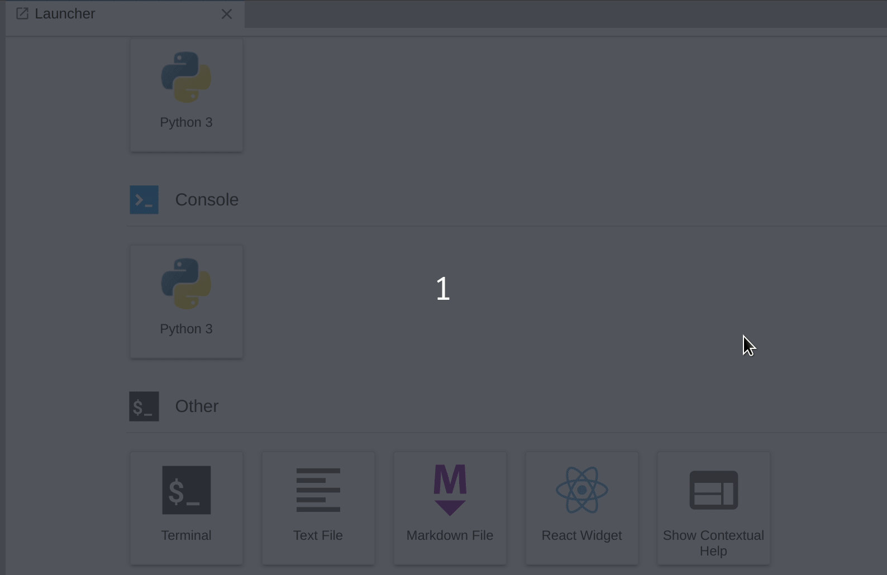

# JupyterLab Extension using React




## Install
Install miniconda or conda from [here](https://docs.conda.io/projects/conda/en/latest/user-guide/install/index.html).

Execute the following commands:

```bash
#creating conda environment and installing jupyterlab
conda create -n jupyterlab-ext --override-channels --strict-channel-priority -c conda-forge -c anaconda jupyterlab cookiecutter nodejs git && conda activate jupyterlab-ext && conda install -c conda-forge jupyterlab=2
```

Cloning this repository:

```bash
# Clone the repo to your local environment
git clone https://github.com/aranite-open/sample-dev-templates.git

# cd to the jupyterlab_react directory
cd sample-dev-templates/jupyterlab_ext

# Install dependencies and build the project
jlpm && jlpm build && jupyter labextension link . && jlpm build && jupyter lab build && jlpm watch
```

Now the framewroking is watching your files and whenever there is a change, it will try building your code automatically. Don't termiate the process. Instead, open up a new terminal window/tab. Make sure you are in the `jupyterlab_react` folder. Execute the following command:

```bash
conda activate jupyterlab-ext && jupyter lab --watch
```

This should open up jupyterlab in your default browser where you can find the React Widget (see the GIF above).

Happy hacking!
